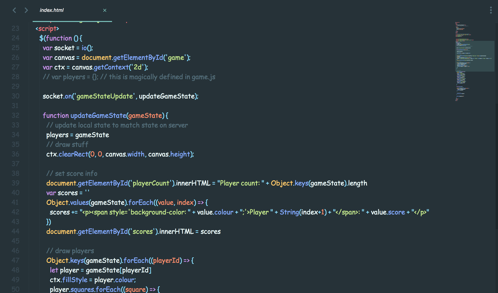

# Comic Sans Toggle

Astound your coworkers by toggling your Sublime Text font to Comic Sans before pairing sessions.

# Usage

Press `ctrl + .` to toggle between Comic Sans and whatever font you've set in your global settings. The font `Comic Sans MS` needs to be available on your system, but it should work by default for at least MacOS.

